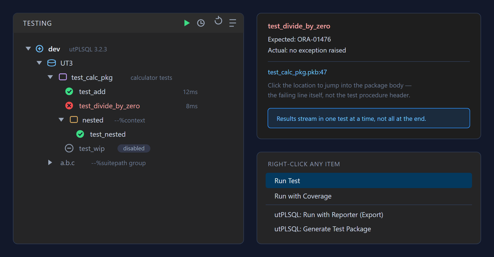
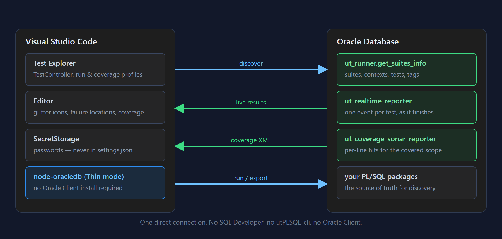
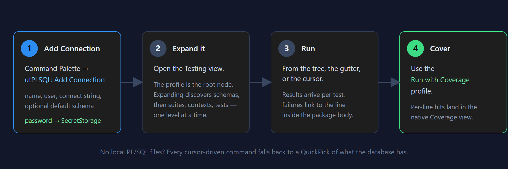
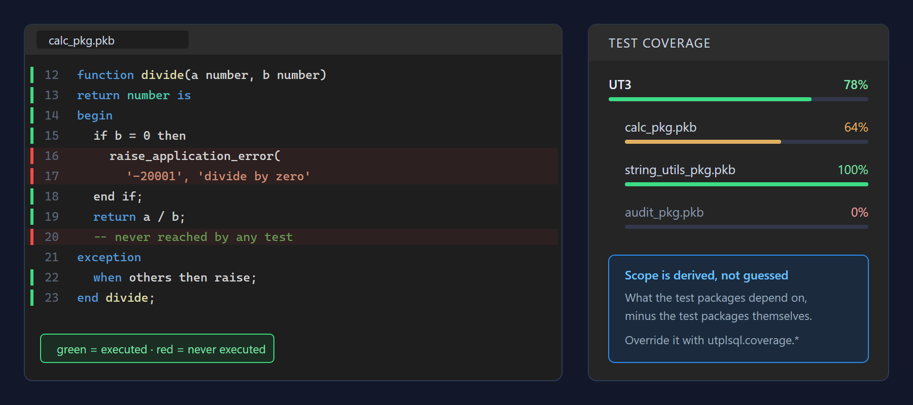

# utPLSQL for VS Code

Run [utPLSQL](https://github.com/utPLSQL/utPLSQL) unit tests directly from Visual Studio Code's
native Testing API — Test Explorer, gutter run icons, inline failure locations, code coverage
and reporter export, without needing SQL Developer, PL/SQL Developer or the `utPLSQL-cli`.

> [!IMPORTANT]
> **This is not an official utPLSQL project.** It is an independent, community-built extension
> that talks to utPLSQL's public database API. It is not affiliated with, endorsed by, or
> maintained by the [utPLSQL project](https://github.com/utPLSQL/utPLSQL) or its contributors.
> utPLSQL itself is a separate project under its own licence.
>
> Please report anything wrong with **this extension** in
> [its own issue tracker](https://github.com/paddi35/utplsql-for-vscode/issues) — not to the
> utPLSQL project, which cannot support it.

---

## What you get



Your suites appear in VS Code's own Testing view. They are discovered from the **database**, not
from your files, so the tree is whatever `ut_runner.get_suites_info` actually reports —
`--%suite`, `--%context`, `--%suitepath` groups, tags and `--%disabled` markers included.

- **Live progress.** Results stream in one test at a time via the real-time reporter protocol,
  so a long suite tells you about failure #1 immediately instead of after the last test.
- **Failure locations that land where the bug is.** A failed expectation jumps to the failing
  line inside the package **body**, not to the test procedure's header.
- **Lazy tree.** Expanding a node resolves only that level. A schema with hundreds of packages
  does not have to be turned into `TestItem`s before you can click anything.

---

## How it works



The extension connects **straight to the database** through
[`node-oracledb`](https://github.com/oracle/node-oracledb) in Thin mode. There is no Oracle Client
to install, no CLI to keep on your `PATH`, and no intermediate process — which is also why the
only credentials involved are the ones you give it, stored in VS Code's `SecretStorage`.

Everything it shows you comes from three utPLSQL entry points: `ut_runner.get_suites_info` for
the tree, `ut_realtime_reporter` for live results, and the coverage reporters for per-line hits.

---

## Requirements

- Oracle Database with **utPLSQL >= 3.1.3** installed (>= 3.1.4 for the real-time reporter used
  for running tests; discovery and reporter export need >= 3.1.3 for `get_suites_info`).
- VS Code **1.137** or newer.
- Network access from the machine running VS Code to the database.

---

## Getting started



### 1. Add a connection

Run **utPLSQL: Add Connection** from the Command Palette (`Ctrl+Shift+P`). You will be asked for:

| Prompt | What to enter |
|---|---|
| **Name** | Anything you like — it becomes the root node's label, e.g. `dev`. |
| **User** | The database user that owns or can see the test packages. |
| **Connect string** | Easy Connect (`host:1521/SERVICE`) or a TNS alias. Pick *Enter manually* if you have no `tnsnames.ora`. |
| **Default schema** | Optional. Leave empty to use the connecting user's own schema. |
| **Password** | Stored in VS Code's `SecretStorage` — never in `settings.json`, never logged. |

An empty password is accepted and recorded as "no password yet"; run **utPLSQL: Set Password for
Connection** before using the profile.

### 2. Expand it in the Testing view

Open the **Testing** view (the flask icon in the Activity Bar). Your profile is the root node,
labelled with the utPLSQL version detected on that connection. Expanding it discovers schemas
that actually contain suites, then the suite tree per schema.

If nothing appears, the connection reached the database but found no suites — see
[Troubleshooting](#troubleshooting).

### 3. Run

Three ways, all equivalent:

- the run icons in the Testing view (a single test, a package, a whole schema, or a multi-select),
- the gutter icons next to `--%suite` / `--%test` annotations in your source files,
- **utPLSQL: Run Test at Cursor**.

### 4. Add coverage

Use the **Run with Coverage** profile instead of plain Run.



The covered scope is **derived, not guessed**: what the test packages depend on, minus the test
packages themselves. Objects reached only dynamically (`execute immediate`, triggers) never
appear in `*_dependencies` and so are never found automatically — add them with
`utplsql.coverage.includeObjects`.

---

## Working without local source files

None of the above needs a local copy of your PL/SQL. If the database is your only source of
truth, the extension stays fully usable:

- The tree is built from the database either way.
- Failure locations and coverage open a read-only `utplsql-source://` document with the source
  fetched from the database.
- **Run Test at Cursor**, **Run with Reporter (Export)** and **Generate Test Package** fall back
  to a QuickPick of discovered objects when there is no cursor to resolve.
- Right-clicking an item in the Testing view offers **Run with Reporter (Export)** and
  **Generate Test Package** for that item directly.

If you *do* keep sources in the workspace, they need a language ID the extension recognises
(`sql` or `oracle-sql` by default, see `utplsql.discovery.languageIds`) so objects can be mapped
to files. An `oracle-sql` language is contributed for the common extensions (`.pkb`, `.pks`,
`.pls`, `.plb`, `.tps`, `.tpb`, `.prc`, `.fnc`, `.trg`, `.vw`); add `files.associations` entries
yourself for anything else.

---

## Exporting results

**utPLSQL: Run with Reporter (Export)** runs any output reporter your utPLSQL install offers —
documentation, JUnit, TAP, TeamCity, Sonar and whatever else `ut_runner` reports — and writes it
to the Output channel or a file.

The **Export with Reporter** run profile does the same for an arbitrary Test Explorer selection,
producing one file per connection profile involved. Both are cancellable; cancelling drops the
partial output rather than saving a truncated report as if it were finished.

---

## Troubleshooting

| Symptom | Cause and fix |
|---|---|
| The profile appears but expanding it shows nothing | The user can connect but sees no suites. Check you are looking at the right schema (`defaultSchema`), and that the packages really carry `--%suite`. utPLSQL needs a **blank line** before the first `--%test` or the package is silently invisible to `get_suites_info`. |
| A newly added `--%test` does not show up | utPLSQL caches annotations. Run **utPLSQL: Rebuild Annotation Cache**, which rebuilds it and refreshes the tree. |
| `ORA-01017` when running | The stored password no longer matches. Run **utPLSQL: Set Password for Connection**. The pool is rebuilt on the next attempt, so the fix takes effect immediately. |
| "no free connection … pool max" | A run, coverage build, tree resolve or export is using every pooled connection. Wait for it to finish. |
| Coverage shows 0% for an object you know is exercised | It is probably outside the derived scope — reached only via `execute immediate` or a trigger. Add it to `utplsql.coverage.includeObjects`. |
| Failure locations open an empty editor | No local file matched the object, and the virtual document could not be fetched. Check the user can read the source (`all_source`/`dba_source`). |
| Everything is slow and you want to know why | Set `utplsql.perf.enabled` and read the `utPLSQL` output channel; see [docs/performance.md](docs/performance.md). Use `utplsql.trace` for per-event detail — it is noticeably slower, so leave it off otherwise. |

---

## Commands

| Command | Description |
|---|---|
| `utplsql.addConnection` | Add a new connection profile. |
| `utplsql.setPassword` | (Re-)store a connection's password in `SecretStorage`. |
| `utplsql.removeConnection` | Remove a connection profile and its stored password. |
| `utplsql.runTestAtCursor` | Run the suite/test/package at the cursor position. Without a usable cursor (a virtual `utplsql-source://` document, or no local source file at all) falls back to a QuickPick of the profile's discovered database objects. |
| `utplsql.runWithTags` | Run all tests carrying one or more chosen `--%tags(...)` values, for a connection profile. |
| `utplsql.rebuildAnnotations` | Rebuild utPLSQL's own `--%annotation` cache for a profile's discovered schemas, then refresh the Test Explorer — use this if a newly added/changed `--%test` isn't showing up after a recompile. |
| `utplsql.runWithReporter` | Run the package at the cursor, the right-clicked Test Explorer item, or one picked from a QuickPick, with a chosen output reporter, to the Output channel or a file. The **Export with Reporter** run profile does the same for an arbitrary Test Explorer selection, one file per connection profile involved. |
| `utplsql.generateTest` | Generate a test package skeleton for the unit at the cursor, the right-clicked Test Explorer item, or one picked from a QuickPick of the profile's `testables()`. |

## Settings

| Setting | Default | Description |
|---|---|---|
| `utplsql.connections` | `[]` | Connection profiles (`name`, `user`, `connectString`, optional `defaultSchema`). Managed via the commands above; edit directly only if you know what you're doing. |
| `utplsql.connections.tnsAdminPath` | `""` | Folder containing `tnsnames.ora`. Falls back to the Oracle SQL Developer extension's `sqldeveloper.connections.tnsConfiguration.path` — but only a user/machine-level value for it, never one set by a workspace, since that setting's scope belongs to that extension and is not ours to restrict — then to `TNS_ADMIN`. If empty and you enter a TNS alias directly as the connect string, `node-oracledb` still resolves it itself at connect time. |
| `utplsql.discovery.languageIds` | `["sql", "oracle-sql"]` | Language IDs treated as PL/SQL source for discovery and parsing. |
| `utplsql.run.randomOrder` | `false` | Run tests in a random order (`a_random_test_order`) instead of declaration order, to surface hidden order dependencies between tests. |
| `utplsql.run.randomOrderSeed` | `0` | Seed for `utplsql.run.randomOrder`. `0` leaves the seed unset (a new one every run, not reproducible); a positive value reproduces the same order every run. |
| `utplsql.coverage.htmlReport` | `false` | Also run `ut_coverage_html_reporter`, writing the report to a temporary file and offering it via a notification (**Open in Browser** / **Save As…**) instead of rendering it in a webview — its HTML is assembled by the database from database-derived text (schema/object names, source lines) that on a shared schema you may not have written yourself. |
| `utplsql.coverage.excludeObjects` | `[]` | Additional object names (e.g. `UT`, `UT_EXPECTATION`) excluded from the automatically derived coverage scope — e.g. when utPLSQL itself is installed in the same schema as the code under test. |
| `utplsql.coverage.schemes` / `utplsql.coverage.includeObjects` | `[]` | Fully override the automatically derived `a_coverage_schemes`/`a_include_objects` — useful for objects reached only dynamically (`execute immediate`, triggers), which never show up in `*_dependencies`. Empty = automatic. |
| `utplsql.coverage.includeSchemaExpr` / `includeObjectExpr` / `excludeSchemaExpr` / `excludeObjectExpr` | `""` | Regex-based coverage scoping (`a_include_schema_expr` etc.), applied on top of the automatic/overridden scope. |
| `utplsql.coverage.reporter` | `"sonar"` | The native Coverage view always uses `ut_coverage_sonar_reporter`; set to `"cobertura"` to additionally run `ut_coverage_cobertura_reporter` and get offered a save dialog for it after each coverage run. |
| `utplsql.reporter.clientCharacterSet` / `utplsql.reporter.colorConsole` | `""` / `false` | `a_client_character_set`/`a_color_console` for `utplsql.runWithReporter` and the **Export with Reporter** run profile. |
| `utplsql.generate.*` | see `package.json` | Test generation options: package/unit prefix/suffix, tests-per-unit, comments, disabled-by-default, suite path, indent. Mirrors utPLSQL's SQL Developer test generator settings. |
| `utplsql.trace` | `false` | Detailed per-event logging (suite/test start and end, one line per received real-time reporter event) to the `utPLSQL` output channel. Useful for troubleshooting; noticeably slower on large test runs (see `utplsql.perf.enabled`), so leave it off otherwise. |
| `utplsql.perf.enabled` | `false` | Timing instrumentation for discovery/run steps (tree build, event throughput) to the `utPLSQL` output channel. See `docs/performance.md`. |
| `utplsql.perf.reportFile` | `""` | When set and `utplsql.perf.enabled` is on, also appends each timing measurement as a JSON line to this file. |

---

## Known limitations

- **No PL/SQL debugger.** VS Code has no built-in PL/SQL debug adapter for this extension to
  drive, so stepping through PL/SQL is out of scope for now.
- **Suite path collisions across schemas.** utPLSQL suite paths don't carry the owning schema.
  Running suites that share the same path in two different schemas in a single run can
  misattribute a live event to the wrong schema's test item — the same known limitation Oracle
  SQL Developer's utPLSQL integration has.
- **`DATE` columns in a `sys_refcursor` comparison.** Without `ut.set_nls`/`ut.reset_nls` around
  the comparison, `DATE` values are compared using the session's default NLS date format instead
  of as a proper date-time value. `ut.set_nls` must stay active through both `OPEN`s *and* the
  `to_equal`/`to_contain` call itself — calling `ut.reset_nls` any earlier raises `ORA-01861`
  (confirmed against a live utPLSQL 3.2.3 instance; `ut.pks`'s own doc comment only says
  `ut.reset_nls` must run "after refcursor is open", which is necessary but not sufficient). See
  the `ut-nls-cursor` snippet for the verified sequence.

---

## Development

```sh
npm install
npm run test           # typecheck + unit tests (no database needed)
npm run watch          # esbuild --watch, for iterating in the Extension Development Host (F5)
npm run package        # build a .vsix with vsce
```

Integration tests need a real utPLSQL-equipped Oracle instance. A ready-made one is available via
Docker. The credentials it uses (`ut3` / `oracle`, overridable via `ORACLE_PASSWORD`) are
throwaway defaults for a local, disposable container — never point this compose file at anything
reachable from outside your machine:

```sh
docker compose up -d --build   # starts gvenzl/oracle-free with utPLSQL installed into schema UT3
npm run test:integration
```

The container is ready in well under a minute: the faststart base image ships an already-created
database, and only the utPLSQL install runs at first startup.

`docker-compose.override.yml` adds a named volume so that database survives a container rebuild.
Compose picks that file up automatically — but note the volume is populated once and never
refreshed afterwards, so changes to `docker/oracle-utplsql/init-scripts/` (a new utPLSQL version,
say) only take effect after `docker compose down -v`. CI sets `COMPOSE_FILE` explicitly and
therefore runs without the volume, which is deliberate: an empty volume mounted over
`/opt/oracle/oradata` hides the prebuilt database and forces a full 45-minute recreation.

Point the integration tests at a different instance/schema with the `UTPLSQL_IT_USER`,
`UTPLSQL_IT_PASSWORD` and `UTPLSQL_IT_CONNECT_STRING` environment variables (defaults match the
`docker-compose.yml` setup above).

The fixture also provisions a second, deliberately unprivileged user (`utplsql_vsc_unpriv`,
holding nothing but `CREATE SESSION`) and grants the utPLSQL schema read access to
`v$session` plus `dba_objects`/`dba_dependencies`/`dba_source`. Both are there for tests that
cannot be written without them: the session-lifecycle assertions in `cancel.test.ts` and
`pool.test.ts` need to observe sessions from outside themselves, and the per-profile
`dba_`/`all_` caching regression needs two connections that see the data dictionary
differently. Override the second user with `UTPLSQL_IT_UNPRIV_USER` and
`UTPLSQL_IT_UNPRIV_PASSWORD`; where it does not exist, the tests that need it skip themselves
rather than fail.

The diagrams in this README are authored as SVG in `docs/images/` and rasterised to PNG alongside
them — the VS Code Marketplace rejects SVG in a README, so the PNGs are what the README
references. The extension icon is the same arrangement: `docs/images/icon-source.png` is the
full-resolution original, and the shipped `icon.png` is a 256×256 rendering of it, which is what
keeps the packaged `.vsix` at a couple of hundred KB rather than a megabyte. Re-render either
after editing (any headless Chromium will do):

```sh
chrome --headless --force-device-scale-factor=2 --window-size=900,470 \
  --screenshot=docs/images/test-explorer.png docs/images/test-explorer.svg
```

## Credits

This extension's database protocol layer is a TypeScript port of
[utPLSQL for SQL Developer](https://github.com/utPLSQL/utPLSQL-SQLDeveloper) (Apache-2.0) — its
`UtplsqlDao`/`RealtimeReporterDao`, event model, PL/SQL parser and test generator are
IDE-independent and were reused rather than reinvented. See [NOTICE](./NOTICE) for the full
attribution.

That reuse is what the Apache-2.0 licence permits, and nothing more: it does not make this
extension part of the utPLSQL project, and the utPLSQL name is used here only to describe what
the extension integrates with. All thanks for the framework itself go to the utPLSQL
maintainers — the bugs in this extension are mine.

## Security

- Passwords are stored only in VS Code's `SecretStorage`, never in settings and never written to
  the output channel.
- `utplsql.connections`, `utplsql.connections.tnsAdminPath`, `utplsql.perf.enabled` and
  `utplsql.perf.reportFile` are all **machine-scoped**: a workspace cannot contribute or override
  any of them, so opening someone else's repository can't redirect a connection profile (and its
  stored password) at another host, or turn on performance logging to a workspace-chosen file.
- `utplsql.connections.tnsAdminPath`'s fallback to the Oracle SQL Developer extension's
  `sqldeveloper.connections.tnsConfiguration.path` only honours a value set at user/global level,
  never one from a workspace, since that setting's scope belongs to that extension and is not
  ours to restrict. Without that check, a workspace could still redefine the TNS alias a
  stored-password connection profile names and redirect that connection to another host, despite
  our own settings being machine-scoped.
- `utplsql.perf.reportFile` is additionally validated at write time: even a value configured at
  user/machine level is only used if it resolves inside an open workspace folder, so a mistyped or
  unexpected path can't append to an unrelated file elsewhere on disk.
- The coverage HTML report is opened in your browser rather than rendered in a webview. Its
  markup is assembled by the database from object names and source lines; utPLSQL 3.2.3 escapes
  them, but the extension does not rely on that staying true at every version.
- The extension is disabled in [untrusted workspaces](https://code.visualstudio.com/docs/editor/workspace-trust).

Found a security issue? Please report it via
[GitHub Security Advisories](https://github.com/paddi35/utplsql-for-vscode/security/advisories/new)
rather than a public issue.

## License

[Apache-2.0](./LICENSE) — see also [NOTICE](./NOTICE).
